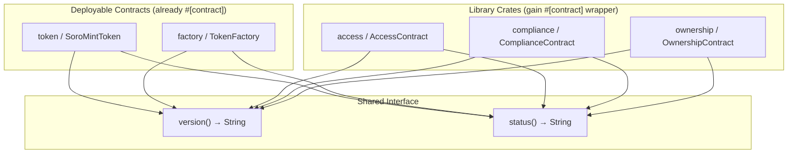

# Design Document: Contract Versioning & Health

## Overview

This feature adds two public introspection functions — `version()` and `status()` — to all five
SoroMint Soroban smart contracts. These functions allow monitoring dashboards, back-end services,
and developer tooling to query a contract's deployed revision and liveness without any authorization.

`token` and `factory` already have working implementations. The primary design challenge is that
`access`, `compliance`, and `ownership` are **library-style crates** — they contain free functions
and no `#[contract]`/`#[contractimpl]` macro. They cannot be deployed or invoked as standalone
contracts. The design must resolve this structural gap.

### Key Design Decision: Wrapper Contracts for Library Crates

Because `access`, `compliance`, and `ownership` are Rust library crates (no `#[contract]` macro),
they cannot expose callable on-chain entry points directly. The chosen approach is to **add a thin
`#[contract]` wrapper struct inside each library crate** that exposes the full public interface
including `version()` and `status()`. This is the same pattern already used in the test files for
those crates (e.g., `AccessTestContract`, `ComplianceTestContract`, `TestContract`), which proves
the pattern compiles and works in the Soroban environment.

Rationale for this approach over alternatives:
- **Alternative: separate wrapper crate** — adds unnecessary crate proliferation and build
  complexity for what is a small addition.
- **Alternative: add `#[contract]` only in tests** — does not satisfy the requirement that every
  contract exposes `version()` and `status()` as callable on-chain functions.
- **Chosen: add `#[contract]` struct + `#[contractimpl]` block in the library source** — minimal
  change, consistent with existing test patterns, and makes the crate deployable.

The library crates will gain a `crate-type = ["cdylib"]` entry in their `Cargo.toml` so they can
be compiled to WASM for deployment, matching `token` and `factory`.

---

## Architecture



All five contracts expose an identical `version()` / `status()` surface. The version string is a
compile-time constant (`"1.0.0"`) embedded directly in each contract's source — no storage reads
are required, keeping the functions cheap and authorization-free.

---

## Components and Interfaces

### 1. `token` contract (`contracts/token/src/lib.rs`)

Already implemented. No changes required.

```rust
pub fn version(e: Env) -> String { String::from_str(&e, "1.0.0") }
pub fn status(e: Env) -> String  { String::from_str(&e, "alive") }
```

### 2. `factory` contract (`contracts/factory/src/factory.rs`)

Already implemented. No changes required.

```rust
pub fn version(e: Env) -> String { String::from_str(&e, "1.0.0") }
pub fn status(e: Env) -> String  { String::from_str(&e, "alive") }
```

### 3. `access` contract (`contracts/access/src/access.rs`)

Add a `#[contract]` struct and `#[contractimpl]` block that wraps all existing free functions and
adds `version()` / `status()`. The existing free functions remain unchanged so that any crate
depending on them as a library is unaffected.

```rust
#[contract]
pub struct AccessContract;

#[contractimpl]
impl AccessContract {
    /// Returns the contract version string.
    /// # Returns
    /// A semver `String` (e.g., `"1.0.0"`).
    pub fn version(e: Env) -> String { String::from_str(&e, "1.0.0") }

    /// Returns the contract liveness status.
    /// # Returns
    /// The `String` `"alive"` when the contract is healthy.
    pub fn status(e: Env) -> String { String::from_str(&e, "alive") }

    // ... delegating wrappers for initialize_admin, grant_role, revoke_role, has_role
}
```

### 4. `compliance` contract (`contracts/compliance/src/compliance.rs`)

Same pattern as `access`.

```rust
#[contract]
pub struct ComplianceContract;

#[contractimpl]
impl ComplianceContract {
    pub fn version(e: Env) -> String { String::from_str(&e, "1.0.0") }
    pub fn status(e: Env) -> String  { String::from_str(&e, "alive") }
    // ... delegating wrappers for set_blacklist_status, is_blacklisted, require_not_blacklisted
}
```

### 5. `ownership` contract (`contracts/ownership/src/ownership.rs`)

Same pattern as `access`.

```rust
#[contract]
pub struct OwnershipContract;

#[contractimpl]
impl OwnershipContract {
    pub fn version(e: Env) -> String { String::from_str(&e, "1.0.0") }
    pub fn status(e: Env) -> String  { String::from_str(&e, "alive") }
    // ... delegating wrappers for initialize_owner, transfer_ownership, accept_ownership, get_owner
}
```

### 6. `docs/contract-api.md`

A new Markdown file at the repository root documenting all public functions for all five contracts,
including `version()` and `status()` with example return values.

---

## Data Models

`version()` and `status()` are **pure functions** — they read no storage and write no storage.
The version string is a compile-time string literal embedded in the binary.

```
VERSION_STRING = "1.0.0"   // semver MAJOR.MINOR.PATCH
STATUS_STRING  = "alive"   // fixed liveness sentinel
```

No new `DataKey` variants, no new storage entries, and no new events are introduced by this
feature. The functions are intentionally stateless to keep them cheap and always-available.

### Cargo.toml changes for library crates

The three library crates need `crate-type = ["cdylib"]` added so they can be compiled to WASM:

```toml
# contracts/access/Cargo.toml  (and compliance, ownership)
[lib]
crate-type = ["cdylib"]
```

They also need `soroban-sdk` imported with the `contract` / `contractimpl` macros, which are
already available in the existing `soroban-sdk = "22.0.0"` dependency — no version bump needed.

---

## Correctness Properties

*A property is a characteristic or behavior that should hold true across all valid executions of a
system — essentially, a formal statement about what the system should do. Properties serve as the
bridge between human-readable specifications and machine-verifiable correctness guarantees.*

### Property 1: Version idempotence

*For any* contract instance, calling `version()` twice in the same environment must return
identical strings.

**Validates: Requirements 1.3, 4.3**

### Property 2: Status idempotence

*For any* contract instance, calling `status()` twice in the same environment must return
identical strings.

**Validates: Requirements 2.4, 4.4**

### Property 3: Version conforms to semver format

*For any* contract instance, the string returned by `version()` must match the pattern
`MAJOR.MINOR.PATCH` where each component is a non-negative integer (e.g., `"1.0.0"`).

**Validates: Requirements 1.2**

### Property 4: Status is always "alive"

*For any* contract instance in any state, `status()` must return exactly the string `"alive"`.

**Validates: Requirements 2.2**

### Property 5: Version and status require no authorization

*For any* contract instance and any caller (including one with no auth context), `version()` and
`status()` must succeed without panicking.

**Validates: Requirements 1.4, 2.3**

---

## Error Handling

`version()` and `status()` are designed to be infallible:

- They perform no storage reads, so there are no missing-key panics.
- They require no authorization, so there are no auth-failure panics.
- `String::from_str` on a valid UTF-8 literal cannot fail in the Soroban SDK.

No new error types or panic conditions are introduced by this feature.

---

## Testing Strategy

### Dual Testing Approach

Both unit tests and property-based tests are used. Unit tests verify concrete examples and
integration points; property tests verify universal invariants across generated inputs.

### Unit Tests (per contract)

Each contract's `#[cfg(test)]` module gains:

1. `test_version_returns_expected` — assert `version()` returns `"1.0.0"`.
2. `test_status_returns_alive` — assert `status()` returns `"alive"`.
3. `test_version_idempotent` — call `version()` twice, assert both results are equal.
4. `test_status_idempotent` — call `status()` twice, assert both results are equal.

For `access`, `compliance`, and `ownership`, the tests use the new `#[contract]` wrapper struct
(same pattern as the existing test contracts in those files).

### Property-Based Testing

**Library**: [`proptest`](https://github.com/proptest-rs/proptest) — the standard property-based
testing library for Rust. Add to `[dev-dependencies]` in each affected crate:

```toml
proptest = "1"
```

Each property test runs a minimum of **100 iterations** (proptest default is 256, which exceeds
the minimum).

Each test is tagged with a comment in the format:
`// Feature: contract-versioning-health, Property N: <property_text>`

#### Property test outline (same structure for all five contracts)

```rust
// Feature: contract-versioning-health, Property 1: version idempotence
proptest! {
    #[test]
    fn prop_version_idempotent(_seed: u64) {
        let e = Env::default();
        let id = e.register(MyContract, ());
        let client = MyContractClient::new(&e, &id);
        prop_assert_eq!(client.version(), client.version());
    }
}

// Feature: contract-versioning-health, Property 2: status idempotence
proptest! {
    #[test]
    fn prop_status_idempotent(_seed: u64) {
        let e = Env::default();
        let id = e.register(MyContract, ());
        let client = MyContractClient::new(&e, &id);
        prop_assert_eq!(client.status(), client.status());
    }
}

// Feature: contract-versioning-health, Property 3: version semver format
proptest! {
    #[test]
    fn prop_version_semver_format(_seed: u64) {
        let e = Env::default();
        let id = e.register(MyContract, ());
        let client = MyContractClient::new(&e, &id);
        let v = client.version().to_string();
        let parts: Vec<&str> = v.split('.').collect();
        prop_assert_eq!(parts.len(), 3);
        for part in &parts {
            prop_assert!(part.parse::<u64>().is_ok());
        }
    }
}

// Feature: contract-versioning-health, Property 4: status is always "alive"
proptest! {
    #[test]
    fn prop_status_is_alive(_seed: u64) {
        let e = Env::default();
        let id = e.register(MyContract, ());
        let client = MyContractClient::new(&e, &id);
        prop_assert_eq!(client.status().to_string(), "alive".to_string());
    }
}

// Feature: contract-versioning-health, Property 5: no auth required
proptest! {
    #[test]
    fn prop_no_auth_required(_seed: u64) {
        let e = Env::default();
        // Deliberately do NOT call e.mock_all_auths()
        let id = e.register(MyContract, ());
        let client = MyContractClient::new(&e, &id);
        // These must not panic
        let _ = client.version();
        let _ = client.status();
    }
}
```

Properties 1 and 2 (idempotence) are logically related but test different functions, so both are
kept. Properties 3 and 4 are complementary (format vs. exact value) and are not redundant.
Property 5 is distinct — it validates the authorization surface, not the return value.

### Coverage

The `version()` and `status()` functions are two-line pure functions. The unit tests and property
tests together will achieve well above 95 % line coverage for those functions. The existing test
suites for each contract already cover the rest of the codebase; the new tests add to that
baseline without removing any existing tests.
