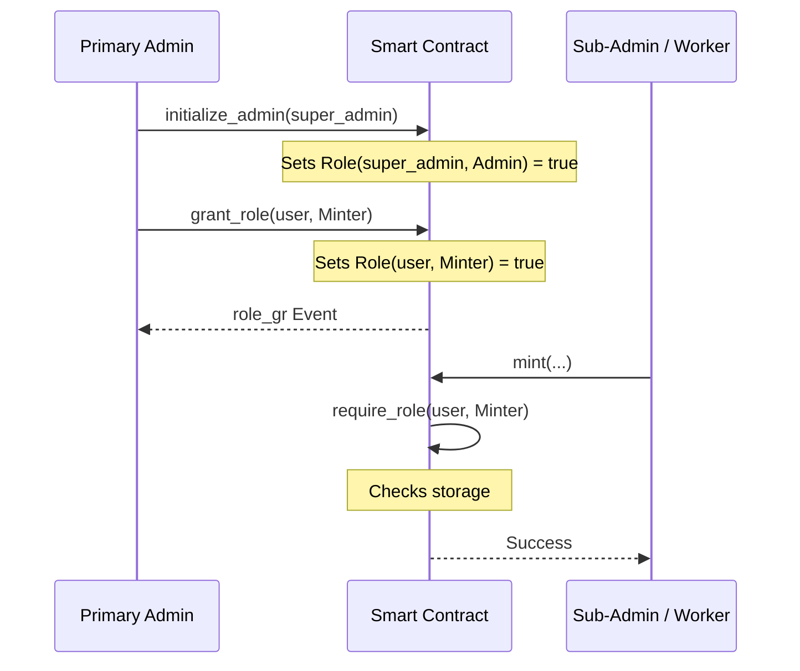

# Role-Based Access Control (RBAC) Module

The SoroMint RBAC module provides a flexible, multi-admin permission system. It allows for the delegation of specific operational roles (like Minting or Pausing) to different addresses, managed by one or more administrators.

## Roles

The module defines the following roles:

1.  **Admin (1)**: Can grant and revoke any role, including the Admin role itself.
2.  **Minter (2)**: Authorized to perform token minting operations.
3.  **Pauser (3)**: Authorized to pause and unpause contract operations.

## Features

- **Multi-Admin Support**: Multiple addresses can hold the Admin role simultaneously.
- **Granular Permissions**: Roles are specific to actions, following the principle of least privilege.
- **Event-Driven**: All role changes (`grant` and `revoke`) emit events for off-chain auditing.
- **Security Guards**: Reusable `require_role` guards to protect sensitive contract functions.

## Process Flow

## Functions

### `initialize_admin(admin: Address)`
- **Action**: Bootstraps the first administrator. 
- **Security**: Should be called only once during contract initialization.

### `grant_role(granter: Address, user: Address, role: Role)`
- **Access**: Requires `granter` to have the `Admin` role.
- **Action**: Grants `role` to `user`.
- **Event**: Emits `role_gr` with `(granter, user, role)`.

### `revoke_role(revoker: Address, user: Address, role: Role)`
- **Access**: Requires `revoker` to have the `Admin` role.
- **Action**: Revokes `role` from `user`.
- **Event**: Emits `role_rv` with `(revoker, user, role)`.

### `has_role(user: Address, role: Role) -> bool`
- **Access**: Public (View).
- **Action**: returns true if `user` has `role`.

### `require_role(user: Address, role: Role)`
- **Action**: Panics if `user` does not have `role`.

## Implementation Details

The RBAC logic is located in `contracts/access/src/access.rs`.

### Security Assumptions
- The initial admin set via `initialize_admin` is the trusted root of authority.
- Role escalations are prevented by requiring the `Admin` role for any `grant_role` call.
- All administrative actions are authorized and logged via events.
