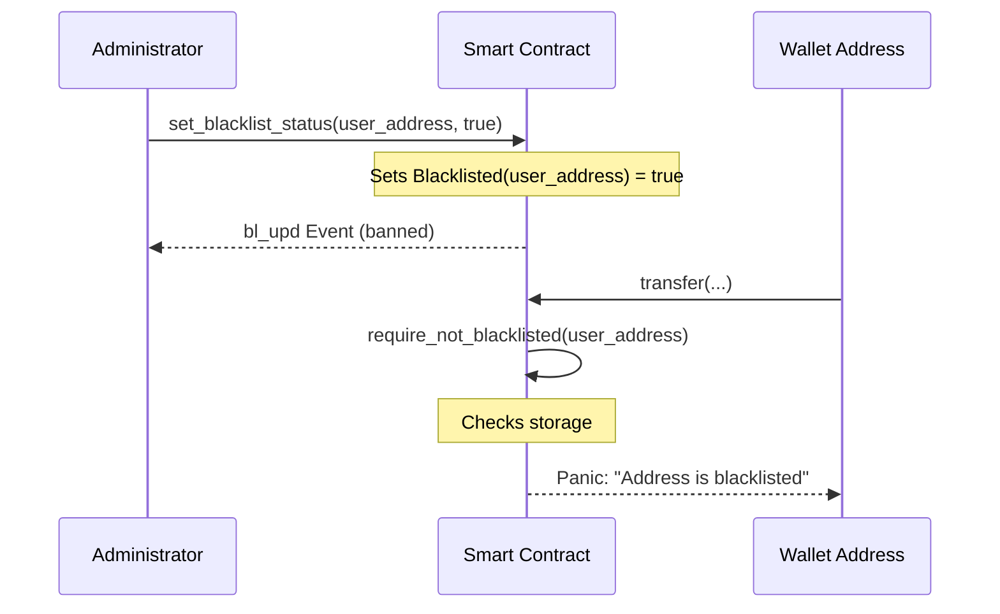

# Compliance Layer: Blacklist/Whitelist Mechanism

The SoroMint protocol includes a compliance layer that allows administrators to manage a blacklist of addresses. Addresses on the blacklist are prohibited from interacting with token functions such as minting and transferring.

## Features

- **Address-based Blacklisting**: Admins can ban specific wallet addresses.
- **Persistent Storage**: The blacklist status is stored in the contract's persistent storage.
- **Event Logging**: All blacklist updates emit a `bl_upd` event for transparency and off-chain indexing.
- **Guard Functions**: Reusable guards that can be integrated into any contract function to enforce compliance.

## Process Flow

## Functions

### `set_blacklist_status(admin: Address, addr: Address, banned: bool)`

- **Access**: Requires `admin` authorization.
- **Action**: Updates the blacklist status of `addr`.
- **Event**: Emits `bl_upd` with `(admin, addr, banned)`.

### `is_blacklisted(addr: Address) -> bool`

- **Access**: Public (View).
- **Action**: Returns current status of `addr`.

### `require_not_blacklisted(addr: Address)`

- **Action**: Panics if `addr` is blacklisted. Use this as a guard in state-changing functions.

## Implementation Details

The compliance logic is located in `contracts/compliance/src/compliance.rs`.

### Security Assumptions

- The `admin` address passed to `set_blacklist_status` should be the contract owner or an authorized compliance officer.
- The `require_not_blacklisted` guard should be called at the beginning of sensitive functions (e.g., `transfer`, `mint`, `burn`).
