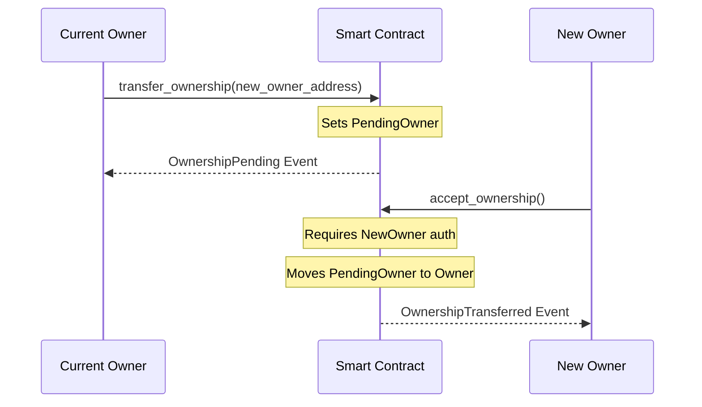

# Ownership Model: Two-Step Handshake

The SoroMint protocol uses a secure two-step handshake process for transferring administrative control (ownership) of smart contracts. This prevents accidental loss of control due to entering an incorrect address.

## Why Two-Step?

In a traditional one-step transfer, ownership is immediately moved to the new address. If that address is incorrect (e.g., a typo or an address the user doesn't control), the contract becomes unmanaged and potentially bricked.

With a two-step handshake:

1. **Initiate**: The current owner nominates a `pending_owner`.
2. **Accept**: The `pending_owner` must actively claim the role by calling the contract.

Control is only transferred once the new address proves it can interact with the contract.

## Process Flow

## Functions

### `transfer_ownership(new_owner: Address)`

- **Access**: Only the current `Owner`.
- **Action**: Sets the `PendingOwner` storage variable.
- **Event**: Emits `owner_pe` with the previous owner and new pending owner.

### `accept_ownership()`

- **Access**: Only the `PendingOwner`.
- **Action**: Updates `Owner` to the caller and clears `PendingOwner`.
- **Event**: Emits `owner_tr` with the previous and new owner.

## Implementation Details

The ownership logic is implemented in `contracts/ownership/src/ownership.rs`. It uses Soroban instance storage to persist the owner and pending owner addresses.

### Security Assumptions

- The contract must be initialized with an owner using `initialize_owner`.
- `require_owner` can be used as a guard in other functions to restrict access to the current administrator.
